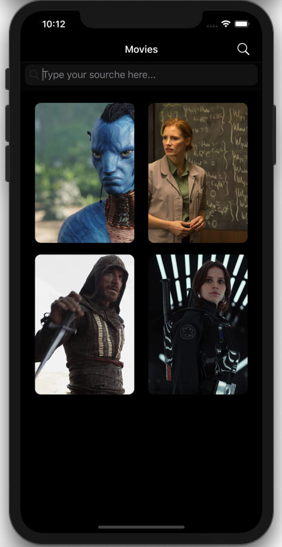
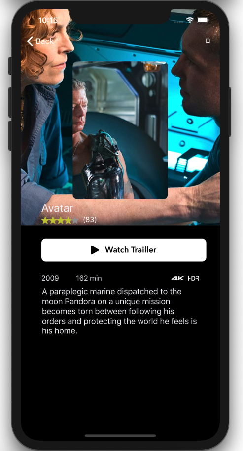

# challangeNetflix

## Descrição

Este repositório se trata de um app com informações de filmes.

Com esse app pude aprender:

* Lista com dado estático;
* Lista com dado dinâmico;
* URL Session;
* Codable e Decodable;

Tela principal             | Tela de detalhes
:-------------------------:|:-------------------------:
   |  
